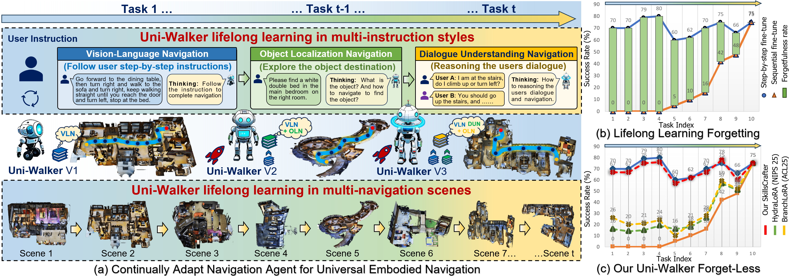
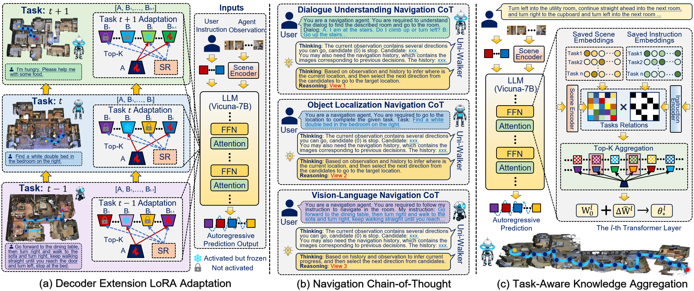

# Lifelong Embodied Navigation Learning

Embodied navigation agents powered by large language models have shown strong performance on individual tasks but struggle to continually acquire new navigation skills, which suffer from catastrophic forgetting. We formalize this challenge as lifelong embodied navigation learning (LENL), where an agent is required to adapt to a sequence of navigation tasks spanning multiple scenes and diverse user instruction styles, while retaining previously learned knowledge. To tackle this problem, we propose Uni-Walker, a lifelong embodied navigation framework that decouples navigation knowledge into task-shared and task-specific components with Decoder Extension LoRA (DE-LoRA). To learn the shared knowledge, we design a knowledge inheritance strategy and an experts co-activation strategy to facilitate shared knowledge transfer and refinement across multiple navigation tasks. To learn the specific knowledge, we propose an expert subspace orthogonality constraint together and a navigation-specific chain-of-thought reasoning mechanism to capture specific knowledge and enhance instruction-style understanding. Extensive experiments demonstrate the superiority of Uni-Walker for building universal embodied navigation agents with lifelong learning.

<!-- This repository contains the codes for our paper "Towards Learning a Generalist Model for Embodied Navigation". -->

## Methods
<p align="center">
    <br>
</p>


<p align="center">
    <br>
</p>
Illustration of the proposed Uni-Walker pipeline. It includes (a) a Decoder Extension LoRA Adaptation to achieve progressive knowledge decoupled learning, which decouples navigation knowledge into shared and specific parts, thereby facilitating new tasks learning using shared knowledge while avoiding forgetting. (b) a Navigation Chain-of-Thought to design various specific LLM chains of thought for specific instruction style navigation tasks to facilitate the embodied navigation performance. (c) a Task-Aware Knowledge Aggregation to automatically aggregate the learned knowledge according to a specific navigation task and loads the aggregated knowledge for inference.

## Installation
1. Install the [MatterPort 3D simulator](https://github.com/peteanderson80/Matterport3DSimulator). Please add the simulator path to yout python path.
```
export PYTHONPATH=Matterport3DSimulator/build:$PYTHONPATH
```

2. Create the conda environment and install the requirements.
```
conda create --name UniWalker python=3.8.16
conda activate UniWalker
pip install -r requirements.txt
```

## Data Processing
The data directory is structed as follows. 

```
data
├── connectivity
├── CVDN
├── LLaVA
├── R2R
├── REVERIE
├── eva_features
│   ├── mp3d_EVA02-CLIP-L-14-336.hdf5
│   ├── scanqa_EVA02-CLIP-L-14-336.hdf5
│   └── coco_EVA02-CLIP-L-14-336.hdf5
├── obj_features
│   ├── reverie_obj_feat
│   └── soon_obj_feat
├── models
    └── Vicuna-7B
```

**1. Orinal Datasets**
* R2R & REVERIE & SOON: we use the annotation provided by [DUET](https://github.com/cshizhe/VLN-DUET).
* CVDN: The annotation could be downloaded from [the official repository](https://github.com/mmurray/cvdn).
* LLaVA: [LLaVA-detail-23k](https://huggingface.co/datasets/liuhaotian/LLaVA-Instruct-150K) is used for insturction following.
* Augmented Data from R2R and REVERIE: We utilize the augmented data generated by [DUET](https://github.com/cshizhe/VLN-DUET).

**2. Image Features**

The image features are extracted with [EVA-CLIP-02-Large (428M)](https://github.com/baaivision/EVA). To use EVA-CLIP-02, please install the corresponding environment following the instruction of th original reposity.
```
cd scripts/data_tools
sh extract_features_mp3d.sh         # for Matterport3D
```

**3. Object Features**

We leverage the object features extracted from ViT-B16 by [HM3DAutoVLN](https://github.com/cshizhe/HM3DAutoVLN),  and put the processed features of REVERIE at data/obj_features. You could either disable the object features by removing the flag `--enable_og`.

**4. Models**

The LLM is built upon [Vicuna-7B-v1.1](https://github.com/lm-sys/FastChat/blob/main/docs/vicuna_weights_version.md#how-to-apply-delta-weights-for-weights-v11-and-v0). Please download the pre-trained model and put it at data/models.

## Training & Inference
**1. Continual Learning Training**:
```bash
sh train_task.sh
```

**4. Multi-Tasks Evaluation**:
```bash
sh evl_task.sh 
```

## Acknowledgements
We would like to thank MatterPort 3D for their contributions to the open-sourced platform and community.
Additionally, this work benefits from [NaviLLM](https://github.com/zd11024/NaviLLM), [DUET](https://github.com/cshizhe/VLN-DUET), [HM3DAutoVLN](https://github.com/cshizhe/HM3DAutoVLN), and [VLN-SIG](https://github.com/jialuli-luka/VLN-SIG). Thanks for their awesome works!
